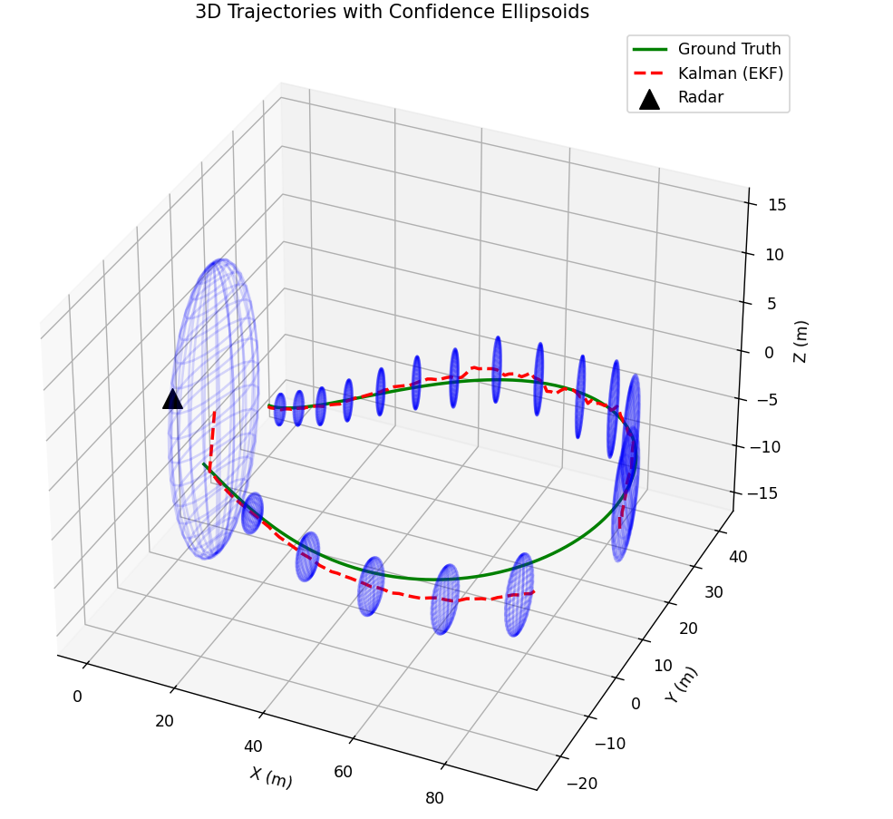
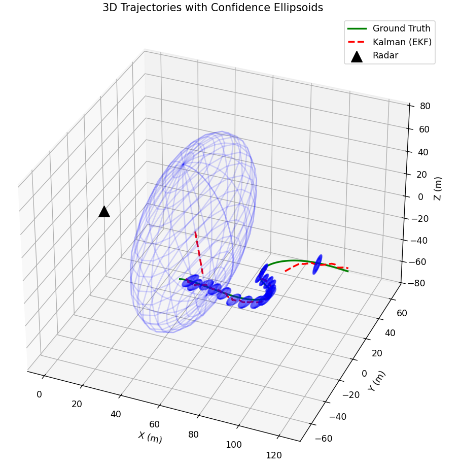

# Benchmark 3 — Centered Measured Kalman Filter

## 1. Objective

The objective of this benchmark is to evaluate the performance of the Centered Measured Kalman Filter (CMKF).

The previous benchmarks showed that the standard EKF can handle partial updates relatively well, while partial initialization can lead to degraded tracking performance. A heuristic reset strategy was previously introduced, with a reset threshold of 1.2, and was identified as the most effective overall configuration for handling partial initialization while maintaining the standard EKF's performance on full measurements.

The CMKF provides an alternative approach by performing the position update directly in Cartesian coordinates. This avoids the position measurement Jacobian used by the standard EKF and provides a different formulation for incorporating position measurements and their associated uncertainty.

---

## 2. Experimental Configurations

The benchmark uses the same dataset and evaluation methodology as the previous benchmarks. Values are given as mean / 95th percentile.

The following configurations are used as references:

- Standard EKF without partial initialization and without partial updates.
- Standard EKF without partial initialization and with partial updates.
- Standard EKF with partial initialization and without partial updates.
- Full Restart Heuristic (threshold 1.2) with partial initialization and with partial updates.

---

## 3. Global Evaluation of the CMKF

### 3.1 Without Partial Initialization and Without Partial Updates

| Configuration | Track Availability | Position Error [m] | Velocity Error [m/s] | Mahalanobis Error | NLL Error |
|---|---:|---:|---:|---:|---:|
| **CMKF** | **88.55%** | **1.73 / 4.99** | **2.49 / 8.14** | **10.37 / 37.33** | **8.83 / 22.38** |
| Standard EKF | 90.84% | 1.81 / 5.20 | 2.63 / 8.59 | 12.79 / 49.96 | 9.94 / 28.55 |

First, the CMKF clearly achieves lower estimation errors than the standard EKF across all evaluated metrics.

The improvement is particularly visible for the Mahalanobis and NLL errors, indicating that the CMKF produces estimates that are not only more accurate in position and velocity, but also better aligned with its estimated uncertainty.

However, the CMKF exhibits a lower track availability than the standard EKF, with 88.55% compared with 90.84%.

The combined lower track availability with consistently lower estimation errors, suggest that the gating of the CMKF is more selective and that it preferentially rejects measurements that are more difficult to accommodate. However, this difference in survival rates introduces a selection bias: the standard EKF evaluates a larger set of measurements, potentially including more challenging cases that can degrade its overall error metrics. Therefore, these global results indicate a more selective and well-behaved filtering process for the CMKF, but they are not sufficient on their own to conclude that it provides superior estimation accuracy.

---

### 3.2 Without Partial Initialization and With Partial Updates

| Configuration | Track Availability | Position Error [m] | Velocity Error [m/s] | Mahalanobis Error | NLL Error |
|---|---:|---:|---:|---:|---:|
| **CMKF** | **89.33%** | **1.75 / 5.10** | **2.50 / 8.17** | **11.31 / 38.52** | **9.30 / 23.13** |
| Standard EKF | 91.73% | 1.84 / 5.30 | 2.64 / 8.62 | 13.81 / 51.06 | 10.45 / 29.21 |
| CMKF — No Partial Inits & Updates | 88.55% | 1.73 / 4.99 | 2.49 / 8.14 | 10.37 / 37.33 | 8.83 / 22.38 |

With partial updates enabled, the CMKF again provides lower errors than the standard EKF for all evaluated metrics.

The CMKF nevertheless maintains a lower global availability than the standard EKF.

With partial updates enabled, the CMKF increases track availability from 88.55% to 89.33%, corresponding to a **0.78 percentage-point increase**, compared with **0.89 percentage points for the standard EKF**. The slightly smaller gain is consistent with the more selective gating of the CMKF, which may reject some partial updates when they fall in regions where the predicted state is less consistent with the measurement. Nevertheless, the increase remains close to that obtained with the standard EKF, indicating that the CMKF is able to effectively exploit partial updates. At the same time, the estimation errors remain very close to those obtained without partial updates, with only a small and non-significant increase across the considered metrics.
 
---

### 3.3 With Partial Initialization and Without Partial Updates

| Configuration | Track Availability | Position Error [m] | Velocity Error [m/s] | Mahalanobis Error | NLL Error |
|---|---:|---:|---:|---:|---:|
| **CMKF** | **89.19%** | **1.89 / 5.26** | **2.56 / 8.38** | **11.77 / 37.63** | **9.62 / 22.80** |
| Standard EKF | 89.89% | 2.09 / 5.79 | 2.84 / 9.12 | 15.92 / 55.61 | 11.65 / 32.08 |
| CMKF — No Partial Inits & Updates | 88.55% | 1.73 / 4.99 | 2.49 / 8.14 | 10.37 / 37.33 | 8.83 / 22.38 |

The standard EKF, as observed in the previous configuration, is unable to effectively exploit partial initialization, with a clear degradation in track availability compared with simply discarding these measurements. 

In contrast, enabling partial initialization in the CMKF increases track availability from 88.55% to 89.19%, corresponding to a **0.64 percentage points** increase. It indicates that the filter is able to exploit these measurements and maintain longer track survival. Moreover, the availability gain from partial initialization **exactly matches** that obtained with the Full Restart Heuristic, indicating that the CMKF successfully exploits essentially all partial initializations to maintain the track.

The associated increase in estimation errors is expected, as partial initialization provides less information about the initial state than a full initialization and therefore introduces greater initial uncertainty. Overall, these results indicate that the CMKF can effectively exploit partial initialization without the substantial degradation observed with the standard EKF.

This behaviour is consistent with the CMKF formulation, where the approximation is performed on the measurement rather than on the highly uncertain state prediction. This allows the filter to properly initialize the track even when the initial prediction carries a large uncertainty.

| <strong>Successful Partial Initialization with MCKF</strong> | <strong>Failed Partial Initialization with Standard EKF</strong> |
|:---:|:---:|
|  |  |

---

### 3.4 With Partial Initialization and Partial Updates

| Configuration | Track Availability | Position Error [m] | Velocity Error [m/s] | Mahalanobis Error | NLL Error |
|---|---:|---:|---:|---:|---:|
| **CMKF** | **89.81%** | **1.88 / 5.30** | **2.56 / 8.40** | **12.80 / 38.87** | **10.11 / 23.40** |
| Full Restart Heuristic (1.2) | 92.20% | 1.96 / 5.50 | 2.68 / 8.78 | 15.20 / 51.10 | 11.22 / 29.25 |

The combination of partial initialization and partial updates confirms that the CMKF can successfully handle both types of partial measurements simultaneously. The resulting estimation metrics remain consistent with the behaviour observed when partial initialization and partial updates were evaluated separately, with no unexpected degradation.

Compared with the Full Restart Heuristic (1.2), the CMKF achieves lower estimation errors across all considered metrics, while exhibiting lower track availability (89.81% versus 92.20%). This combination of lower errors and lower availability is consistent with the hypothesis that the CMKF employs a more selective gating strategy, preferentially retaining measurements that are better aligned with its prediction.

However, this global comparison alone cannot determine whether the CMKF is intrinsically more accurate, since the two filters do not evaluate exactly the same set of measurements. A common-survival benchmark is therefore required to compare their estimation performance on the same retained states.

---

## 4. Analysis of Track Availability and Measurement Selectivity

### 4.1 The Double-Gating Mechanism

The CMKF uses two measurement updates:

1. a position update performed in Cartesian coordinates;
2. a radial-velocity update performed in the measurement space.

Each update performs its own measurement validation through a Mahalanobis-based gating mechanism.

As a result, a measurement must pass two successive validation stages before the complete update is accepted.

This creates a more selective overall acceptance mechanism than a single gating operation.

The effect becomes particularly relevant because the first position update modifies the state estimate and its covariance before the radial-velocity update is performed.

After the position update, the state covariance can become significantly smaller. The subsequent Doppler innovation is therefore evaluated with a potentially smaller innovation covariance.

Consequently, a Doppler measurement that is compatible with the target motion but differs sufficiently from the prediction can be rejected by the second gating stage.

This behaviour is not necessarily an indication of poor estimation. Instead, it reflects the fact that the CMKF has become more selective about the consistency between the measurements and the predicted state.

---

### 4.2 Interaction with the Constant-Velocity Model

The selectivity of the Doppler gating becomes particularly important for highly manoeuvring targets.

The current prediction model assumes constant velocity. This model is only an approximation of the actual target dynamics.

For moderate target motion, the prediction remains sufficiently close to the actual state for the Doppler measurement to pass the validation gate.

For strong accelerations or abrupt manoeuvres, however, the predicted velocity can differ significantly from the actual velocity.

The CMKF can then identify the measured radial velocity as inconsistent with the predicted state and reject it.

This behaviour can reduce track availability even though accepting the measurement could allow the filter to continue following the target.

The global results therefore suggest that the availability limitation is more likely related to the interaction between the CMKF's selective gating and the current motion model than to an inability to process partial measurements.

---

### 4.3 Diagnostic Experiment: Doppler Gating Disabled

To investigate the origin of the availability limitation, the Doppler gating was disabled while retaining the position gating.

The resulting global performance is:

| Configuration | Track Availability | Position Error [m] | Velocity Error [m/s] | Mahalanobis Error | NLL Error |
|---|---:|---:|---:|---:|---:|
| **CMKF — Position Gating Only** | **96.09%** | 2.40 / 7.58 | 3.13 / 10.76 | 26.63 / 114.03 | 16.70 / 60.76 |
| CMKF — Double Gating | 89.81% | **1.88 / 5.30** | **2.56 / 8.40** | **12.80 / 38.87** | **10.11 / 23.40** |

Removing the Doppler gating produces a substantial increase in track availability, from 89.81% to 96.09%.

This confirms that the Doppler validation stage is responsible for a significant part of the rejected measurements.

However, the increase in availability comes at a substantial cost in estimation quality.

The mean position error increases from 1.88 m to 2.40 m, while the 95th-percentile position error increases from 5.30 m to 7.58 m.

The degradation is even more significant for the uncertainty-related metrics. The mean Mahalanobis error increases from 12.80 to 26.63, and its 95th percentile increases from 38.87 to 114.03.

The same behaviour is observed for the NLL metric.

This experiment demonstrates that the Doppler gating is not simply preventing the filter from tracking difficult targets. It also acts as an effective protection mechanism against measurements that are inconsistent with the current state estimate.

The CMKF therefore exhibits a clear trade-off between track availability and estimation quality:

- retaining the Doppler gate results in lower availability but substantially better estimation quality;
- removing the Doppler gate increases availability but allows inconsistent measurements to influence the filter, degrading the resulting state estimates.

---

## 6. Benchmark Mode Comparison

Global evaluation alone does not provide a complete comparison between the CMKF and the standard EKF.

The two filters do not maintain exactly the same tracks. A filter can therefore obtain a better global error simply because the difficult portions of the dataset are no longer included in its evaluation after a track is lost.

Benchmark mode provides a direct comparison of the estimation quality produced by the two filters under the same surviving tracking conditions.

---

### 6.1 CMKF vs Standard EKF

The comparison is performed between:

- Run 1: CMKF without partial initialization and without partial updates;
- Run 2: Standard EKF without partial initialization and without partial updates.

#### Track Survival Intersection

| Metric | Value |
|---|---:|
| Total survived updates — CMKF | 17,709 |
| Total survived updates — Standard EKF | 18,168 |
| **Common survival** | **17,424** |
| CMKF life shared with Standard EKF | **98.4%** |
| Standard EKF life shared with CMKF | **95.9%** |
| Unique CMKF updates | 285 |
| Unique Standard EKF updates | 744 |

The overlap is very high, making the common-survival comparison representative of almost the entire tracking period of both filters.

#### Estimation Performance on Common States

| Configuration | Position Error [m] | Velocity Error [m/s] | Mahalanobis Error | NLL |
|---|---:|---:|---:|---:|
| **CMKF** | **1.70 / 4.93** | **2.38 / 7.63** | **10.36 / 37.34** | **8.72 / 22.18** |
| Standard EKF | 1.73 / 4.94 | 2.40 / 7.61 | 11.29 / 43.10 | 9.11 / 24.93 |

The common-survival benchmark provides a direct comparison of the estimation accuracy of the two filters on the same retained states. Since these common states are evaluated without partial initialization or partial updates, the comparison reflects the intrinsic estimation performance of the two filtering formulations without the additional effects introduced by partial measurements. And as seen previously, the comparison is based on a highly overlapping set of states.

The CMKF achieves lower errors across all mean accuracy metrics: position error decreases from 1.73 m to 1.70 m, velocity error from 2.40 m/s to 2.38 m/s, Mahalanobis error from 11.29 to 10.36, and NLL from 9.11 to 8.72. The same trend is observed for the 95th-percentile metrics, except for velocity, where the standard EKF is marginally better (7.61 m/s versus 7.63 m/s). Overall, the CMKF therefore demonstrates a modest but consistent improvement in estimation accuracy on the common-survival set.

This result confirms that the lower global availability observed with the CMKF is not due to poorer estimation accuracy. Rather, when both filters retain the same states, the CMKF provides better overall estimation performance. The common-survival benchmark therefore supports the conclusion that the CMKF is more accurate than the standard EKF, independently of its more selective track acceptance behaviour.

---

## 7. Final Interpretation and Conclusion

## 7. Final Interpretation and Conclusion

Overall, the benchmark shows that the CMKF provides a promising alternative to the standard EKF, with a modest but consistent improvement in estimation accuracy on common-survival states. 

A possible explanation lies in the location of the approximation introduced by the nonlinear measurement model. By transforming the measured polar position and its associated uncertainty into Cartesian space, the CMKF avoids linearizing the measurement function around a highly uncertain predicted state. Since the radar measurements are relatively precise, introducing this approximation on the measurement side appears to be more favourable than applying it to the prediction side, particularly when the state uncertainty is large during initialization.

The results on partial measurements should however be distinguished between partial updates and partial initialization. 

Partial updates are not handled intrinsically by the CMKF formulation: when a measurement is incomplete during an update, the corresponding update is performed using the standard EKF formulation. This is not a limitation in practice, since the standard EKF already handles partial updates effectively, as demonstrated by the first benchmark. Partial initialization is fundamentally different. 

The CMKF is able to incorporate incomplete measurements directly into the initialization process, whereas the standard EKF cannot effectively exploit them. Moreover, unlike the heuristic restart strategy, the CMKF does not discard the previous track and restart it when the initial uncertainty becomes large. Instead, it naturally retains the available state information and its associated uncertainty, allowing the Kalman filter to preserve the system's estimated inertia while appropriately reducing the influence of the uncertain initialization measurements.

The main remaining limitation of the CMKF is related to measurement acceptance. Its successive position and radial-velocity updates result in a more selective gating mechanism, since the covariance is already reduced after the first update when the radial-velocity measurement is evaluated. This can lead to measurement rejection when the constant-velocity prediction becomes inaccurate, particularly in high-dynamics scenarios. The heuristic restart strategy therefore remains advantageous in terms of overall track availability, while the CMKF provides better estimation accuracy on commonly retained states. Improving the transition model beyond the current constant-velocity assumption could therefore reduce these prediction errors and potentially make the CMKF substantially more competitive with the heuristic restart strategy.

